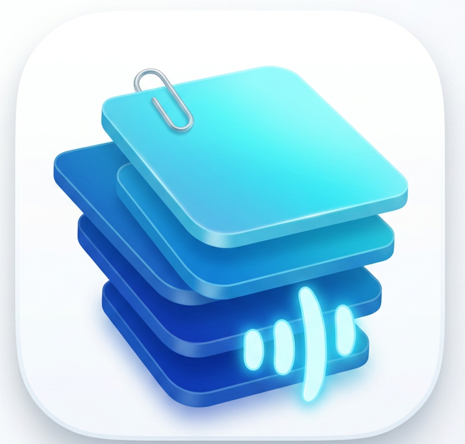

# MyNote Pro 📝

**MyNote Pro** is a modern, privacy-focused productivity application built with Flutter. It combines elegance with powerful features like voice recording, biometric security, and professional PDF exporting, all while keeping your data 100% local on your device.

 <!-- Ensure you have a logo asset -->

## 🌟 Key Features

### ✍️ Professional Editor (WYSIWYG)
- **Rich Text Support**: Seamless Bold and Italic formatting without visible markdown markers.
- **Checklist Mode**: Integrated task lists with interactive strike-through and progress tracking.
- **Adaptive UI**: Toolbar and text colors automatically adjust to ensure visibility against any note background color.

### 🎙️ Multi-Media & Attachments
- **Voice Notes**: Record your thoughts on the go and play them directly within your notes.
- **File & Image Attachments**: Attach photos and documents securely. All files are copied locally to ensure they remain accessible.

### 🛡️ Security & Privacy
- **100% Local Storage**: No accounts, no cloud, no tracking. Your data belongs to you.
- **Biometric Lock**: Protect sensitive notes using fingerprint, Face ID, or system PIN.
- **Auto-Purge Trash**: Deleted notes are kept for 30 days for recovery before permanent deletion.

### 🎨 Organization & Customization
- **Dynamic Categories**: Create and manage categories with custom colors.
- **Smart Archive**: declutter your main view without losing important information.
- **Pinto Layout**: Beautiful staggered grid and list views for your notes.

### 🌍 Global Support
- **Full Localization**: Complete English and Arabic translations (not just direction).
- **RTL Support**: Native-feeling Arabic experience with proper cursor and text alignment.
- **Dark Mode**: Premium, high-contrast dark theme for comfortable night-time use.

---

## 🛠️ Technical Stack

- **Framework**: [Flutter](https://flutter.dev) (Material 3)
- **State Management**: [flutter_bloc](https://pub.dev/packages/flutter_bloc) (Cubit)
- **Database**: [sqflite](https://pub.dev/packages/sqflite) (SQLite)
- **Architecture**: Clean & Modular (Feature-first folder structure)
- **Local Auth**: [local_auth](https://pub.dev/packages/local_auth)
- **PDF Engine**: [pdf](https://pub.dev/packages/pdf) & [printing](https://pub.dev/packages/printing)

---

## 📁 Project Structure

```text
lib/
├── data/           # Database, Models (Note, Category, Checklist)
├── logic/          # Cubits, Localization logic, Services (PDF, Audio, Auth)
└── presentation/   # UI Layer
    ├── pages/      # Feature-based subfolders (Home, Editor, Settings, etc.)
    └── widgets/    # Reusable components (Common, Home, Editor)
```

---

## 🚀 Getting Started

### Prerequisites
- Flutter SDK `^3.4.3`
- Android Studio / VS Code
- Java 17+ (Java 25 compatible via Gradle config)

### Installation
1. Clone the repository:
   ```bash
   git clone https://github.com/yourusername/mynote.git
   ```
2. Install dependencies:
   ```bash
   flutter pub get
   ```
3. Run the app:
   ```bash
   flutter run
   ```

---

## 📄 Exporting Notes
Every note can be exported as a professional **PDF** document. The app preserves your formatting, title, and creation date, making it perfect for printing or formal sharing.

---

## 🤝 Contributing
Feel free to fork the project and submit pull requests. For major changes, please open an issue first to discuss what you would like to change.

## ⚖️ License
Distributed under the MIT License. See `LICENSE` for more information.

---
Developed with ❤️ by **Islam Sayed Abdelaziz**
